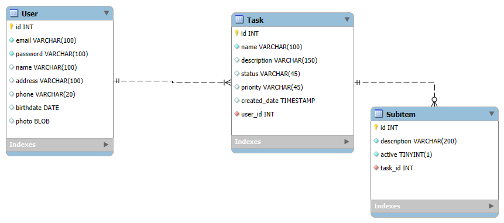

# 🚀 **Fast Task - BackEnd**

Uma aplicação de gerenciamento de tarefas desenvolvida em **Java com Maven**.

---

## 🧩 **Funcionalidades**

- 👤 Gerenciamento de usuários  
- 📋 Gerenciamento de tarefas  
- ✅ Gerenciamento de subitens de tarefas  
- 🔐 Autenticação de usuários  

---

## 🛠 **Tecnologias Utilizadas**

- ☕ Java 21  
- 📦 Maven  
- 🌱 Spring Boot  
- 🐬 MySQL  
- 🔁 JPA / Hibernate  
- 🔒 jBCrypt (para criptografia de senhas)
- 🗓️ Jackson Datatype JSR310 (para suporte a tipos de data e hora do Java 8+)

---

## 🗂 **Estrutura do Projeto**

```bash
br.com.fasttask.fasttask         → Pacote principal da aplicação
├── model                        → Entidades (User, Task, Subitem) 
├── dto                          → Objetos de transferência de dados (DTOs)
├── repository                   → Interfaces de repositório
├── service                      → Regras de negócio
├── controller                   → Requisições HTTP
└── exception                    → Tratamento de exceções personalizadas
```

---

## ⚙️ **Como Executar a Aplicação**

### 1. Clone o repositório

```bash
git clone git@github.com:iolymmoliveira/pift.git
```

### 2. Crie o banco de dados MySQL com o seguinte script 🗄️:

```bash
-- -----------------------------------------------------
-- Schema fastTask
-- -----------------------------------------------------

SET @OLD_UNIQUE_CHECKS=@@UNIQUE_CHECKS, UNIQUE_CHECKS=0;
SET @OLD_FOREIGN_KEY_CHECKS=@@FOREIGN_KEY_CHECKS, FOREIGN_KEY_CHECKS=0;
SET @OLD_SQL_MODE=@@SQL_MODE, SQL_MODE='ONLY_FULL_GROUP_BY,STRICT_TRANS_TABLES,NO_ZERO_IN_DATE,NO_ZERO_DATE,ERROR_FOR_DIVISION_BY_ZERO,NO_ENGINE_SUBSTITUTION';

CREATE SCHEMA IF NOT EXISTS `fastTask` DEFAULT CHARACTER SET utf8 ;
USE `fastTask` ;

-- -----------------------------------------------------
-- Table `fastTask`.`User`
-- -----------------------------------------------------
CREATE TABLE IF NOT EXISTS `fastTask`.`User` (
  `id` INT NOT NULL AUTO_INCREMENT,
  `email` VARCHAR(100) NOT NULL,
  `password` VARCHAR(100) NOT NULL,
  `name` VARCHAR(100) NULL,
  `address` VARCHAR(100) NULL,
  `phone` VARCHAR(20) NULL,
  `birthdate` DATE NULL,
  `photo` MEDIUMBLOB NULL,
  PRIMARY KEY (`id`),
  UNIQUE INDEX `email_UNIQUE` (`email` ASC) VISIBLE)
ENGINE = InnoDB;


-- -----------------------------------------------------
-- Table `fastTask`.`Task`
-- -----------------------------------------------------
CREATE TABLE IF NOT EXISTS `fastTask`.`Task` (
  `id` INT NOT NULL AUTO_INCREMENT,
  `name` VARCHAR(100) NOT NULL,
  `description` VARCHAR(150) NULL,
  `status` VARCHAR(45) NULL,
  `priority` VARCHAR(45) NULL,
  `created_date` TIMESTAMP NULL DEFAULT CURRENT_TIMESTAMP ON UPDATE CURRENT_TIMESTAMP,
  `user_id` INT NOT NULL,
  PRIMARY KEY (`id`),
  INDEX `fk_Tasks_Users_idx` (`user_id` ASC) VISIBLE,
  CONSTRAINT `fk_Tasks_Users`
    FOREIGN KEY (`user_id`)
    REFERENCES `fastTask`.`User` (`id`)
    ON DELETE NO ACTION
    ON UPDATE NO ACTION)
ENGINE = InnoDB;


-- -----------------------------------------------------
-- Table `fastTask`.`Subitem`
-- -----------------------------------------------------
CREATE TABLE IF NOT EXISTS `fastTask`.`Subitem` (
  `id` INT NOT NULL AUTO_INCREMENT,
  `description` VARCHAR(200) NOT NULL,
  `active` TINYINT(1) NOT NULL,
  `task_id` INT NOT NULL,
  PRIMARY KEY (`id`),
  INDEX `fk_Subitems_Tasks1_idx` (`task_id` ASC) VISIBLE,
  CONSTRAINT `fk_Subitems_Tasks1`
    FOREIGN KEY (`task_id`)
    REFERENCES `fastTask`.`Task` (`id`)
    ON DELETE NO ACTION
    ON UPDATE NO ACTION)
ENGINE = InnoDB;


SET SQL_MODE=@OLD_SQL_MODE;
SET FOREIGN_KEY_CHECKS=@OLD_FOREIGN_KEY_CHECKS;
SET UNIQUE_CHECKS=@OLD_UNIQUE_CHECKS;


```


###### 🖼️ Diagrama do Banco de Dados



### 3. Configure o application.properties com as credenciais do seu banco:

Certifique-se de que o nome do banco de dados (fasttask) corresponde ao definido no script SQL.

Exemplo:
```bash
spring.datasource.url = jdbc:mysql://localhost:3306/fasttask?useTimezone=true&serverTimezone=UTC
spring.datasource.username = seu-usuario
spring.datasource.password = sua-senha
```

### 4. Execute o projeto

```bash
mvn spring-boot:run
```

---

### 🔗 Endpoints Disponíveis
#### 👤 /user – Gerenciamento de usuários
-  ```POST /user``` – Criar novo usuário

Exemplos de payload:
```bash
{
  "email": "tetemaria@teste.com",
  "password": "123456",
  "name": "Maria Tereza"
}
```
```bash
curl --location 'http://localhost:8080/user' \
--header 'Content-Type: application/json' \
--data-raw '{
    "email": "emailTeste@teste.com",
    "password": "senha",
    "name": "User Name",
    "address": null,
    "phone": null,
    "birthdate": null,
    "photo": null,
    "tasks": null
}'
```

- ```GET /user/{id}``` – Buscar usuário por ID

- ```PUT /user/{id}``` – Atualizar usuário

Exemplo: 
```bash
curl --location --request PUT 'http://localhost:8080/user/7' \
--header 'Content-Type: application/json' \
--data-raw '{
    "id": 7,
    "email": "mariaTeste@teste.com",
    "password": "newPassword",
    "name": "Maria Tester da Silva",
    "address": "Rua dos Bobos, 00",
    "phone": "41 999999999",
    "birthdate": "1987-08-27",
    "photo": null,
    "tasks": []
}'
```

- ```DELETE /user/{id}``` – Deletar usuário

#### 🔐 /user/login – Autenticação
- ```POST /user/login``` – Login com email e senha

Exemplo:
```bash
curl --location 'http://localhost:8080/user/login' \
--header 'Content-Type: application/json' \
--data-raw '{
  "email": "email@teste.com",
  "password": "senha123"
}'
```


#### 📋 /task – Gerenciamento de tarefas
- ```POST /task``` – Criar nova tarefa

Exemplo:
```bash
{
  "name": "Tarefa de teste",
  "description": "Descrição da tarefa de teste",
  "status": "A fazer",
  "priority": "Alta",
  "created_date": "2023-03-01T12:00:00",
  "user": {
    "id": 1
  },
  "subitems": []
}
```

- ```GET /task/{id}``` – Buscar tarefa por ID

- ```PUT /task/{id}``` – Atualizar tarefa

Exemplo:
```bash
curl --location --request PUT 'http://localhost:8080/task/5' \
--header 'Content-Type: application/json' \
--data '{
  "id": 5,
  "name": "Tarefa de teste atualizada",
  "description": "Descrição da tarefa de teste atualizada",
  "status": "Em andamento",
  "priority": "Média",
  "created_date": "2023-03-01T12:00:00",
  "user": {
    "id": 1
  },
  "subitems": []
}'
```

- ```DELETE /task/{id}``` – Deletar tarefa


#### ✅ /subitem – Gerenciamento de subitens
- ```POST /subitem``` – Criar novo subitem

Exemplo:
```bash
curl --location 'http://localhost:8080/subitem' \
--header 'Content-Type: application/json' \
--data '{
    "description": "Subitem de teste",
    "active": true,
    "task": {
        "id": 4
    }
}'
```

- ```GET /subitem/{id}``` – Buscar subitem por ID

- ```PUT /subitem/{id}``` – Atualizar subitem

Exemplo:
```bash
curl --location --request PUT 'http://localhost:8080/subitem/3' \
--header 'Content-Type: application/json' \
--data '{
    "id": 3,
    "description": "Limpar móveis",
    "active": true,
    "task": {
        "id": 4
    }
}'
```

- ```DELETE /subitem/{id}``` – Deletar subitem

---

### 📄 Licença
Este projeto está licenciado sob a Licença MIT.

---
